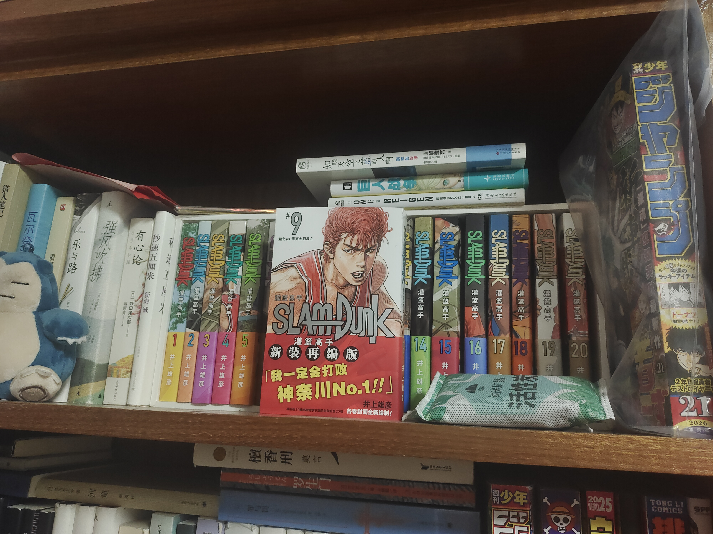
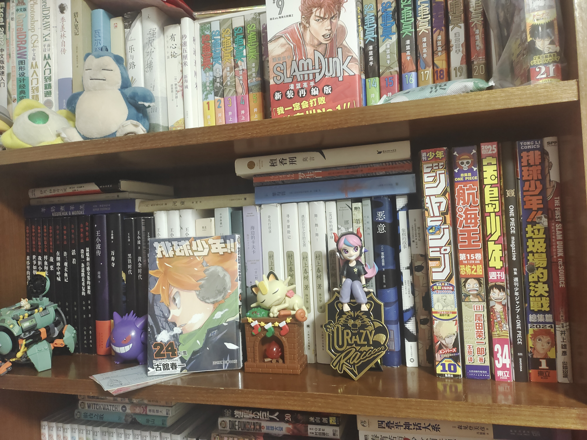
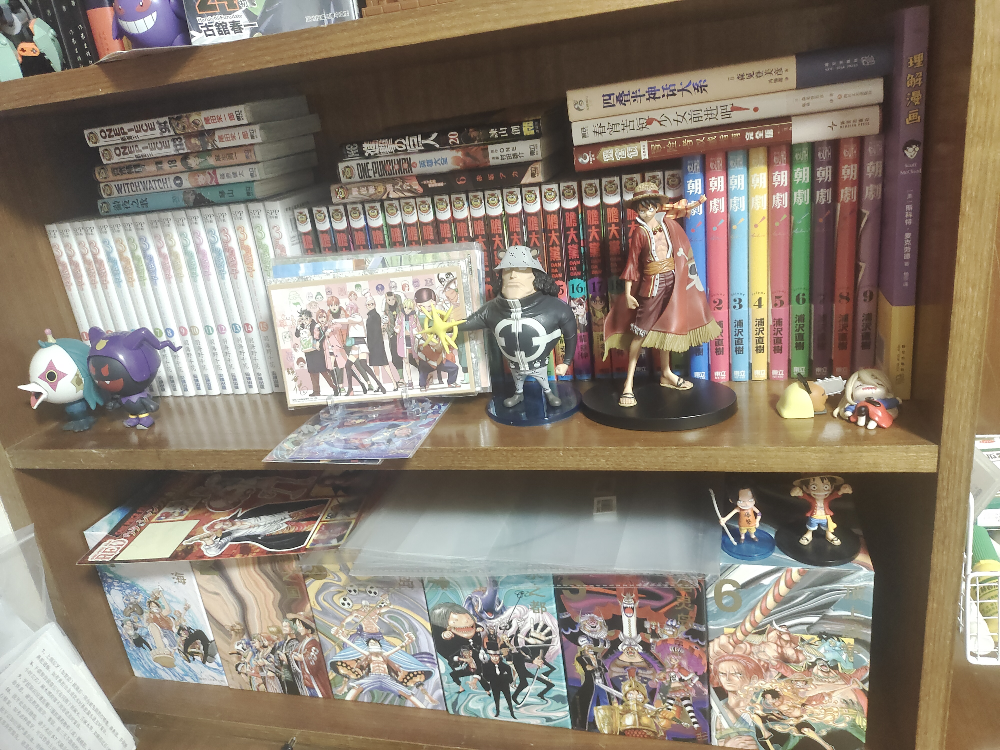
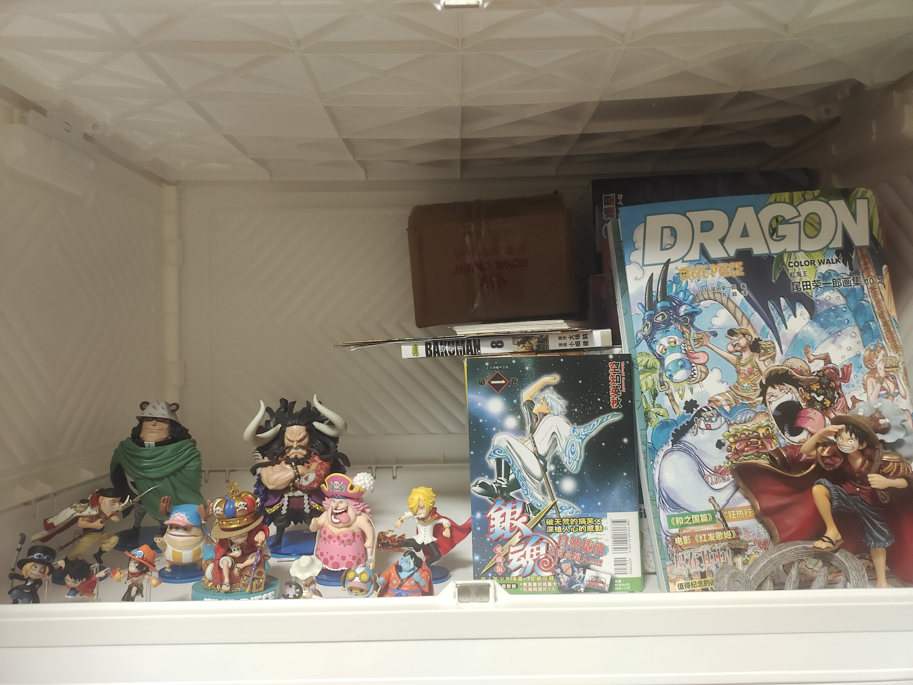

这是我的第二个博客，第一个是用hexo建的。

我喜欢看漫画，最喜欢的漫画家是井上雄彦，主要用kpw6看漫画，也买了几套台版/简体的实体漫画，其实想买能装满两书柜那么多，但没有钱。马上将达到看过100部漫画的成就。最近我在看《路傍の藤井》和《よつばと!》，推荐给大家。

我的专业和计算机相关但太笨了学不会，对英语、日语的学习倒是很感兴趣，日语的目标是过N2，能较轻松地啃生肉。

我喜欢日本音乐，最喜欢的乐队是Official髭男dism。

## 📕 我的收藏

